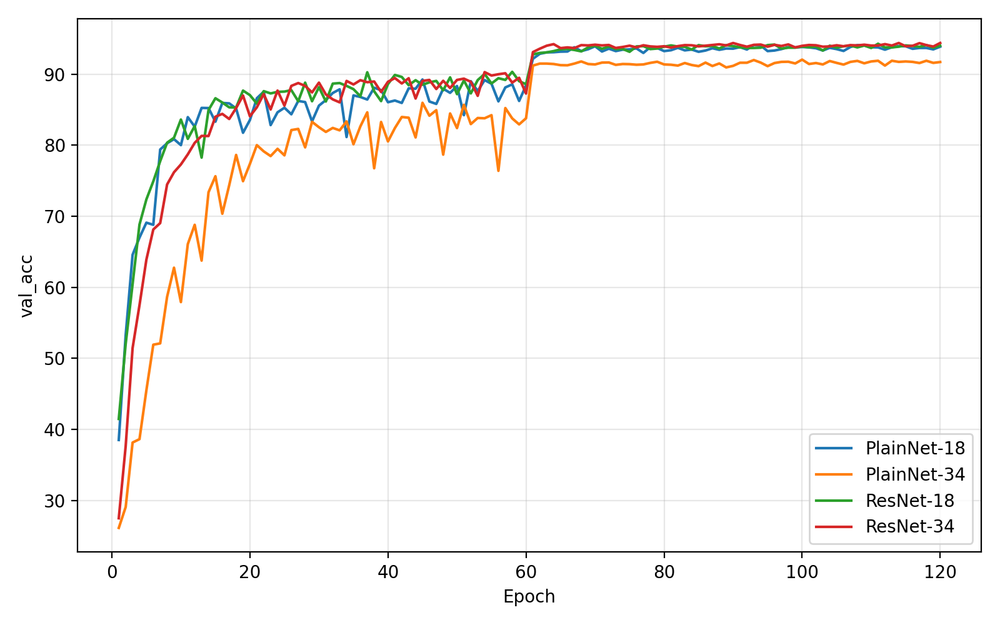
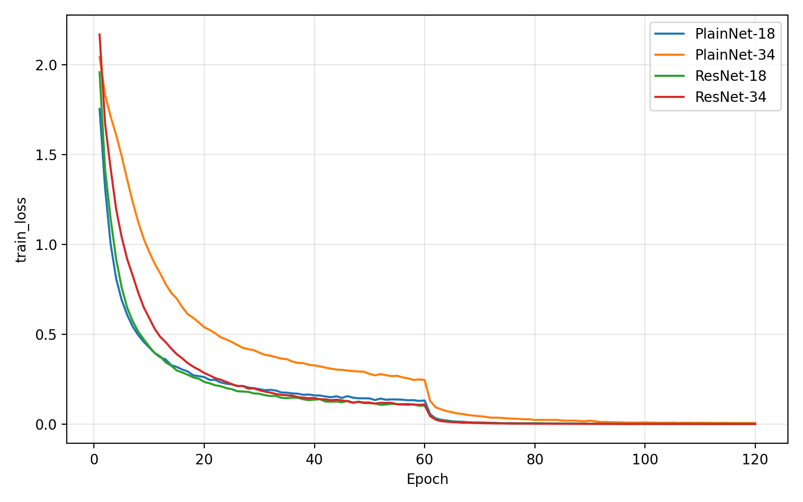
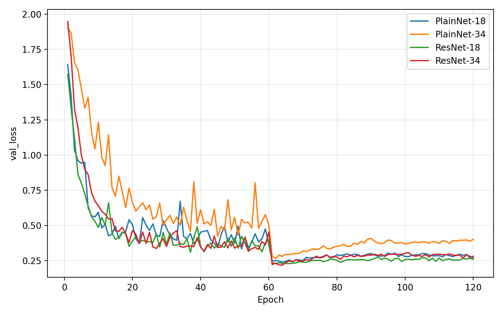

# ResNet 论文复现报告：Deep Residual Learning for Image Recognition

> 论文：Deep Residual Learning for Image Recognition  
> 作者：Kaiming He, Xiangyu Zhang, Shaoqing Ren, Jian Sun
> 数据集：CIFAR-10  
> 复现日期：2026-05-26  
> 代码仓库：待补充 GitHub 链接  
> 负责人：罗禹珩

---

## 摘要

本项目复现 ResNet 论文的核心结论：深层 plain CNN 存在 degradation problem，而 residual connection 能缓解优化困难，使更深的网络获得更低训练误差和更高验证准确率。考虑到完整 ImageNet 复现对算力要求较高，本项目选择 CIFAR-10 作为轻量级复现数据集，并围绕论文核心问题设计了 PlainNet-18、PlainNet-34、ResNet-18 和 ResNet-34 的公平对照实验。

实验结果显示，PlainNet-18 的最佳验证准确率为 94.12%，而更深的 PlainNet-34 下降到 92.06%，说明 plain network 直接加深后出现明显性能退化。相比之下，ResNet-18 和 ResNet-34 的最佳验证准确率分别为 94.30% 和 94.40%，ResNet-34 未出现同样退化，并且相比 PlainNet-34 提升 2.34%。shortcut 消融实验进一步表明，移除 shortcut 后 ResNet-34 的最佳验证准确率从 94.40% 降至 91.84%，说明 residual connection 是性能提升的关键因素。failure analysis 显示，在小数据场景下 ResNet-34 虽然能达到 98.69% 的训练准确率，但验证准确率仅为 65.34%，说明 residual connection 主要解决优化问题，不能自动解决小数据下的过拟合和泛化问题。

---

## 1. Introduction

### 1.1 选题动机

ResNet 是现代计算机视觉模型的重要基础之一。ResNet 的核心贡献不是单纯提出一个更深的 CNN，而是指出并缓解了深层 plain network 中的 optimization degradation problem。传统观点认为，网络越深表达能力越强；但实际训练中，直接堆叠更多层的 plain CNN 可能导致训练误差和验证误差同时变差。这个现象不是典型 overfitting，因为训练集性能本身也会下降。

本项目选择 ResNet 作为经典论文复现对象，目标不是追求完整 ImageNet 复现数值，而是在可控算力下复现论文最核心的实验逻辑：比较 plain network 和 residual network 在不同深度下的训练行为。

### 1.2 本项目要回答的问题

1. PlainNet 加深后是否真的会更难训练或验证性能下降？
2. ResNet 是否能从增加深度中获益？
3. residual connection 的提升是否来自 shortcut 本身，而不只是来自参数量或训练策略？
4. ResNet 在什么条件下仍然会失败？
5. 基于实验结果，能否提出合理的改进方向或边界分析？

---

## 2. Paper Understanding

### 2.1 Degradation Problem

ResNet 论文指出，当网络已经可以正常收敛时，继续加深 plain network 可能导致训练误差升高、验证误差变差。这种现象被称为 degradation problem。它不同于 overfitting，因为 overfitting 通常表现为训练集性能好但验证集性能差；而 degradation problem 中，更深的 plain network 在训练集上也可能更差。

理论上，一个更深网络至少可以模拟浅层网络：额外层只需要学成 identity mapping 即可。但实际优化中，普通非线性层并不容易自动学到恒等映射。因此，问题更接近 optimization issue。

### 2.2 Residual Learning

ResNet 的核心思想是将目标映射从直接学习 `H(x)` 改写为学习残差：

```text
F(x) = H(x) - x
H(x) = F(x) + x
```

也就是说，网络不再强迫若干层直接拟合完整映射 H(x)，而是让它们学习相对于输入 x 的修正量 F(x)。如果最优映射接近 identity mapping，那么残差分支只需要学习接近 0 的映射即可，这比让多层非线性网络直接拟合 identity mapping 更容易。

### 2.3 Shortcut Connection

在 BasicBlock 中，输入 x 通过 shortcut 直接加到卷积分支输出上：

```text
x -> Conv3x3 -> BN -> ReLU -> Conv3x3 -> BN -> + x -> ReLU
```

当输入输出维度相同时，shortcut 使用 identity mapping，不增加参数量；当特征图尺寸或通道数变化时，使用 1x1 convolution projection 进行维度匹配。本项目中的 ResNet-18 和 ResNet-34 均采用 BasicBlock 结构。

---

## 3. Reproduction Setup

### 3.1 Dataset

| 项目 | 内容 |
|---|---|
| 数据集 | CIFAR-10 |
| 原始训练样本数 | 50,000 |
| 实际训练样本数 | 45,000 |
| 验证样本数 | 5,000 |
| 测试样本数 | 10,000 |
| 类别数 | 10 |
| 输入尺寸 | 32 × 32 RGB |
| 数据增强 | RandomCrop(32, padding=4), RandomHorizontalFlip, Normalize |

选择 CIFAR-10 的原因是：它是 ResNet 论文中使用过的图像分类数据集之一，相比 ImageNet 算力要求更低，适合课程项目和个人工作量下的核心现象复现。

### 3.2 Models

| 模型 | 深度 | residual shortcut | 目的 |
|---|---:|---|---|
| PlainNet-18 | 18 | 否 | 浅层 plain baseline |
| PlainNet-34 | 34 | 否 | 深层 plain baseline，用于观察加深后的退化 |
| ResNet-18 | 18 | 是 | 浅层 residual baseline |
| ResNet-34 | 34 | 是 | 深层 residual model，用于验证 residual learning 是否支持加深 |

### 3.3 Training Details

| 超参数 | 设置 |
|---|---|
| optimizer | SGD |
| initial learning rate | 0.1 |
| batch size | 128 |
| epochs | 120 |
| weight decay | 1e-4 |
| momentum | 0.9 |
| scheduler | MultiStepLR |
| milestones | 60, 90 |
| gamma | 0.1 |
| mixed precision | AMP on CUDA |
| random seed | 固定 seed，保证公平对照 |

所有主实验遵守公平对照原则：除模型结构和是否使用 shortcut 外，其余训练设置保持一致。

---

## 4. Main Results

### 4.1 Quantitative Results

| 模型 | Best Epoch | Best Val Acc (%) | Final Train Acc (%) | Final Val Acc (%) | 备注 |
|---|---:|---:|---:|---:|---|
| PlainNet-18 | 93 | 94.12 | 99.96 | 93.88 | 浅层 plain baseline |
| PlainNet-34 | 100 | 92.06 | 99.83 | 91.72 | 深层 plain 网络，性能下降 |
| ResNet-18 | 111 | 94.30 | 99.98 | 94.02 | 浅层 residual baseline |
| ResNet-34 | 90 | 94.40 | 99.98 | 94.40 | 深层 residual 网络，未退化 |

## 4.2 Training Curves

The following figures show the validation accuracy, training loss, and validation loss curves of PlainNet-18, PlainNet-34, ResNet-18, and ResNet-34.

### Validation Accuracy



### Training Loss



### Validation Loss



### 4.3 Analysis

PlainNet-18 的最佳验证准确率为 94.12%，PlainNet-34 的最佳验证准确率为 92.06%。更深的 PlainNet-34 反而下降 2.06%。这说明在没有 residual connection 的情况下，简单增加网络深度没有带来性能提升，反而导致性能退化。

ResNet-18 的最佳验证准确率为 94.30%，ResNet-34 的最佳验证准确率为 94.40%。ResNet-34 相比 ResNet-18 略有提升，至少没有出现 PlainNet-34 那样明显的退化。这说明 residual connection 使深层模型更容易从增加深度中获益。

ResNet-34 的最佳验证准确率为 94.40%，PlainNet-34 为 92.06%，ResNet-34 高出 2.34%。这组对比最直接地支持 ResNet 论文的核心结论：在深度接近的情况下，引入 residual shortcut 可以显著改善深层网络的优化与泛化表现。

---

## 5. Ablation Study

### 5.1 Shortcut 消融

| 模型 | Shortcut | Best Epoch | Best Val Acc (%) | Final Train Acc (%) | Final Val Acc (%) | 结论 |
|---|---|---:|---:|---:|---:|---|
| ResNet-34 | 有 | 90 | 94.40 | 99.98 | 94.40 | baseline |
| ResNet-34 no shortcut | 无 | 100 | 91.84 | 99.68 | 91.36 | 去掉 shortcut 后明显下降 |

移除 shortcut 后，ResNet-34 的最佳验证准确率从 94.40% 降到 91.84%，下降 2.56%。这说明性能提升不是单纯来自网络深度，而是与 residual shortcut 密切相关。shortcut 为深层网络提供了更直接的信息传播路径，也让残差分支可以学习输入的增量修正，从而降低优化难度。

### 5.2 深度消融

| 模型 | 深度 | Best Val Acc (%) | 结论 |
|---|---:|---:|---|
| PlainNet-18 | 18 | 94.12 | 浅层 plain baseline |
| PlainNet-34 | 34 | 92.06 | plain 网络加深后退化 |
| ResNet-18 | 18 | 94.30 | 浅层 residual baseline |
| ResNet-34 | 34 | 94.40 | residual 网络加深后未退化 |

深度消融显示，plain network 加深后性能下降，而 residual network 加深后保持稳定并略有提升。这一结果说明 residual connection 改变了深层网络的可优化性。

### 5.3 Optimizer / Scheduler 消融

| 模型 | Optimizer | Scheduler | Best Epoch | Best Val Acc (%) | Final Val Acc (%) | 结论 |
|---|---|---|---:|---:|---:|---|
| ResNet-34 | SGD | MultiStep | 90 | 94.40 | 94.40 | 原始复现设置 |
| ResNet-34 | AdamW | Cosine | 102 | 93.92 | 93.48 | 略低于 baseline |

AdamW + cosine scheduler 的最佳验证准确率为 93.92%，低于原始 SGD + MultiStep 设置的 94.40%。这说明在当前 CIFAR-10 复现条件下，原始 SGD 训练策略已经足够稳定，替换优化器和 scheduler 没有带来进一步提升。该实验可作为一次改进尝试：改进方向合理，但实验证明其在本设置下并不优于 baseline。

---

## 6. Failure Analysis

### 6.1 Failure Case: 小数据训练

| 模型 | 数据条件 | Best Epoch | Best Val Acc (%) | Final Train Acc (%) | Final Val Acc (%) |
|---|---|---:|---:|---:|---:|
| ResNet-34-full-data | 完整 CIFAR-10 | 90 | 94.40 | 99.98 | 94.40 |
| ResNet-34-small-data | 小数据子集 | 119 | 66.38 | 98.69 | 65.34 |

在完整训练数据下，ResNet-34 的最佳验证准确率为 94.40%。在 small-data setting 下，最佳验证准确率下降到 66.38%，下降 28.02%。与此同时，small-data setting 的最终训练准确率仍达到 98.69%，但最终验证准确率只有 65.34%。

该 failure case 更接近 overfitting / data scarcity problem，而不是 optimization issue。理由是：模型在 small-data setting 下仍然能够很好地拟合训练集，说明训练优化并没有失败；但是验证集表现显著下降，说明模型记住了有限训练样本，无法学习到足够泛化的特征。

Residual connection 能缓解深层网络优化困难，但不能自动解决小数据下的泛化问题。当训练样本不足时，ResNet-34 仍然可能严重过拟合。因此，ResNet 的适用边界之一是：它改善了深层网络的可训练性，但仍然依赖足够数据、合适正则化和数据增强来获得良好泛化。

### 6.2 后续可扩展 Failure Case

本个人复现已完成 small-data failure analysis。若作为小组高分扩展，可继续补充：

1. 类别不平衡：减少部分类别训练样本，观察 minority class recall；
2. 分布偏移：在验证集加入 Gaussian noise / blur，比较 clean vs corrupted accuracy；
3. 标签噪声：随机翻转部分训练标签，观察训练稳定性。

---

## 7. Improvement

### 7.1 改进动机

基于 failure analysis，ResNet 在 small-data setting 下的主要问题是过拟合，而不是训练集无法优化。因此，合理的改进方向应该围绕增强泛化能力，而不是单纯继续加深网络。

### 7.2 已尝试改进：AdamW + Cosine Scheduler

本项目尝试将原始 ResNet-34 的 SGD + MultiStep 训练策略替换为 AdamW + cosine scheduler。

| 方法 | Best Val Acc (%) | 相比 baseline | 结论 |
|---|---:|---:|---|
| ResNet-34 baseline | 94.40 | - | 当前最佳 |
| ResNet-34 + AdamW/Cosine | 93.92 | -0.48 | 未提升 |

结果显示，AdamW + cosine scheduler 在本实验中未超过原始 SGD baseline。因此，该改进未能带来性能提升，但它仍然提供了一个有意义的负结果：在当前 CIFAR-10 设置下，优化器替换不是主要瓶颈。

### 7.3 后续可行改进

更合理的下一步是针对 small-data overfitting 设计改进，例如 MixUp / CutMix / label smoothing，并与 ResNet-34 baseline 做公平对照。如果这些方法能提升 small-data validation accuracy，则可以说明改进确实针对了 failure case 中暴露出的泛化问题。

---

## 8. Personal Workload and Team Scope

本报告对应的是自选题中“一篇论文复现”的个人工作量，而不是整个四人小组的全部项目工作。该部分已完成 ResNet 论文的个人复现任务，包括：

- 论文核心思想梳理；
- PlainNet 与 ResNet 的模型实现；
- CIFAR-10 数据集训练与评估；
- 主实验对照；
- shortcut、深度、优化器消融；
- small-data failure analysis；
- 结果解释与报告撰写。

对于完整小组项目，仍需要其他成员各自完成其负责论文或模块，并在最终汇报中整合多篇论文之间的关系、分工与贡献。

---

## 9. Conclusion

本项目在 CIFAR-10 上复现了 ResNet 论文的核心思想。实验结果显示，PlainNet-34 相比 PlainNet-18 出现明显性能下降，而 ResNet-34 相比 ResNet-18 未出现退化，并且明显优于 PlainNet-34。这说明 residual connection 可以缓解深层 plain network 的优化退化问题。

消融实验进一步证明，shortcut connection 是性能提升的关键因素：移除 shortcut 后，ResNet-34 的最佳验证准确率从 94.40% 下降到 91.84%。optimizer / scheduler 消融显示，AdamW + cosine 在当前设置下未优于原始 SGD baseline，说明本实验的主要收益来自 residual architecture，而不是训练技巧。

Failure analysis 表明，ResNet 并不是万能的。在 small-data setting 下，ResNet-34 训练准确率达到 98.69%，但验证准确率仅为 65.34%，表现出严重过拟合。这说明 residual learning 主要解决深层网络的优化问题，而不能自动解决数据不足导致的泛化问题。

总体而言，本项目支持 ResNet 论文的核心结论，并通过消融与 failure analysis 明确了 residual connection 的作用和边界。

---

## Appendix A. 运行命令

### 主实验

```bash
python train.py --config configs/cifar10_plain18.yaml
python train.py --config configs/cifar10_plain34.yaml
python train.py --config configs/cifar10_resnet18.yaml
python train.py --config configs/cifar10_resnet34.yaml
```

### 消融实验

```bash
python train.py --config configs/ablation_resnet34_no_shortcut.yaml
python train.py --config configs/ablation_resnet34_adamw_cosine.yaml
```

### Failure Analysis

```bash
python train.py --config configs/failure_resnet34_small_data.yaml
```

### 结果汇总与画图

```bash
python analysis/summarize_results.py --logs outputs/logs/cifar10_plain18.csv outputs/logs/cifar10_plain34.csv outputs/logs/cifar10_resnet18.csv outputs/logs/cifar10_resnet34.csv --labels PlainNet-18 PlainNet-34 ResNet-18 ResNet-34 --out outputs/tables/main_results.csv

python analysis/plot_curves.py --logs outputs/logs/cifar10_plain18.csv outputs/logs/cifar10_plain34.csv outputs/logs/cifar10_resnet18.csv outputs/logs/cifar10_resnet34.csv --labels PlainNet-18 PlainNet-34 ResNet-18 ResNet-34 --metric val_acc --out outputs/figures/main_val_acc.png
```

---

## Appendix B. 当前项目状态

| 内容 | 状态 |
|---|---|
| 主实验 | 已完成 |
| shortcut 消融 | 已完成 |
| optimizer/scheduler 消融 | 已完成 |
| small-data failure analysis | 已完成 |
| 类别不平衡实验 | 未完成，建议作为扩展 |
| 分布偏移实验 | 未完成，建议作为扩展 |
| projection shortcut 对比 | 未完成，建议作为扩展 |
| 报告初稿 | 已完成 |
| GitHub 链接 | 待补充 |
| 成员贡献截图 | 待补充到小组总报告 |
